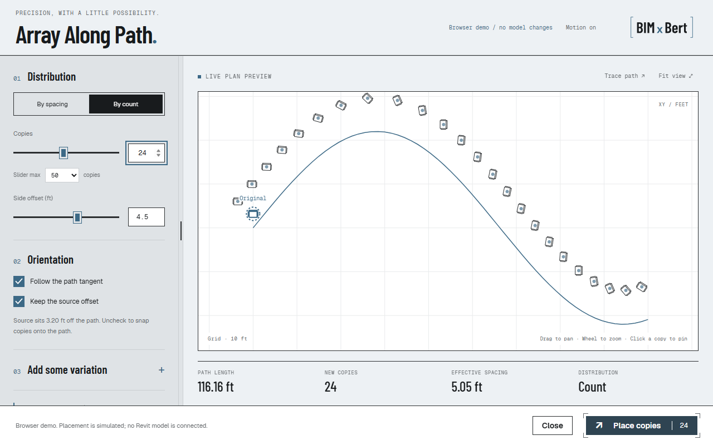
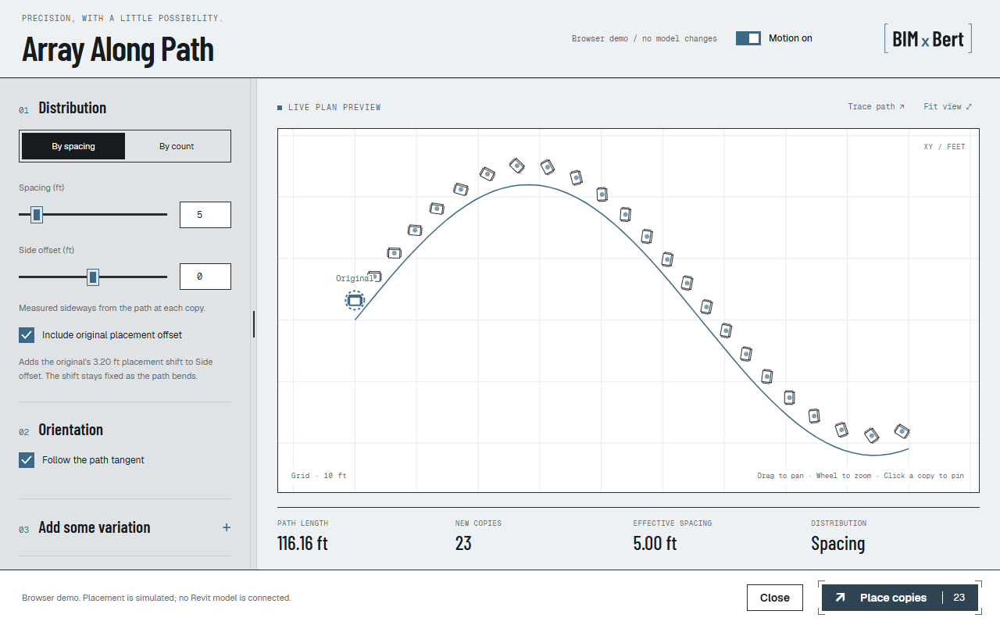
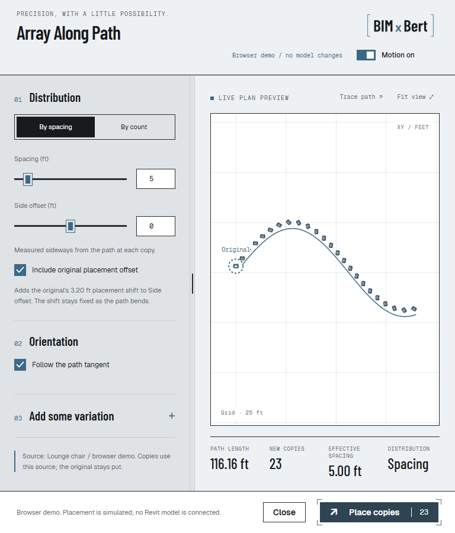
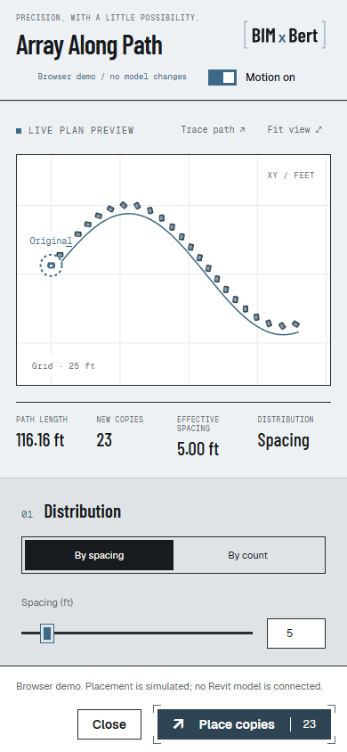
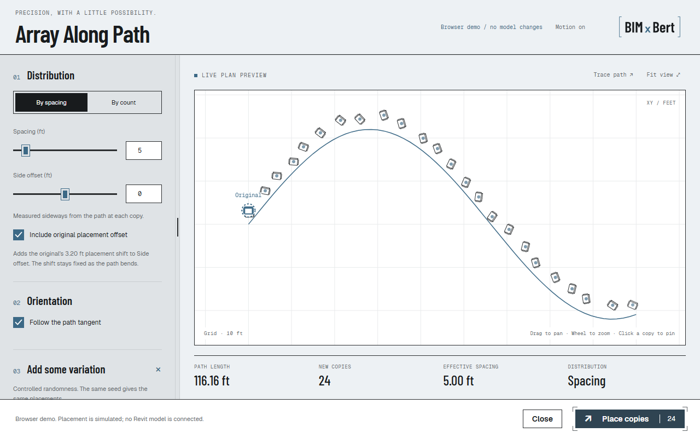

# Array Along Path browser and static verification

Date: 2026-10-02. Browser: Microsoft Edge driven by Playwright.

This evidence covers the new tool's browser simulation and generated files.
It does **not** establish live Revit Undo behavior. Rob's later screenshots show
committed runs of the preceding version; the revised result/count/guide behavior
still needs live verification.

- Initial port: 319 repository tests passed. The 9 Array Along Path tests were
  rerun after the markup revision, including 1/3/2000 new-copy counts.
- 11 extension tests passed; 18 MCP server tests passed in an isolated environment
  with the server's declared dependencies (MCP 2.2.0).
- Root bundle, toolbar spec, branch policy and safety validators passed.
  US English and `git diff --check` passed.
- Both firm profiles render the new tool; generated BIMxBert sandbox passes
  workspace validation and repeat rendering makes no changes.
- Browser interactions checked: spacing/count, valid/invalid inputs, offsets,
  seeded scatter/re-roll, plan simulation, keyboard pane sizing/persistence,
  path replay, responsive layout, system reduced motion and explicit opt-in.
  Narrow layout has no horizontal overflow at 390px. In spacing mode, the
  synthetic source's first-station duplicate is excluded from the new-copy count.
- No client/project data appears in these images; geometry is the synthetic
  demonstration path and chair outline.
- Markup revision: one compact header with the logo at upper right, Close next
  to Place copies, a stationary original outline/label, and Copies instead of
  stations in count mode. The count slider defaults to 50 and supports adjustable,
  persisted limits; entering a larger count expands its range. Verified at
  14/77/2000 copies, including lower-limit clamping and mode/reload behavior.
  Both animated Orientation checkboxes passed pointer, Space-key and reduced-motion
  checks. Original position/rotation remained fixed while those settings changed.
  Refreshed images below show this revision. Live placement/Undo remains unverified.
- Live-run revision: count mode includes the same first offset position as spacing.
  Edge checked 1/24/2000 copies with/without side offset, fixed original, and no
  console errors/warnings. Result formatting is tested against path length, count,
  spacing, offset, orientation, variation, source overlap and Undo wording.
- Shared guide tests cover step changes, Escape/error cleanup, preselection,
  fallback, active-view docking, negative monitor coordinates and DPI scaling.
  Both profile resource contracts include the guide and its packaged wordmarks.
  Native WPF screenshot execution was blocked by Cylance's PowerShell policy;
  no native guide appearance capture is claimed.
- Current revision: all 325 repository tests passed. After correcting the MCP
  test's scope, 32 Array/guide/MCP tests and all 23 generated extension tests passed.
  Integration coverage allows writes in the ribbon tool and still rejects an
  injected transaction in the MCP bridge. Root validators, US English and diff
  checks passed. The sandbox matches its inputs and passes static validation.
- Offset clarity revision: Include original placement offset sits beside Side
  offset in Distribution. On/off helper text distinguishes the fixed original
  shift from the path-relative side offset. The title has no trailing period.
  Ten focused tests and Edge checks passed for helper updates, keyboard Space,
  unchanged original/side offset and responsive layout. Images below are refreshed.
- Motion-control revision: no outer button border; solid brand-blue switch track
  with a white thumb when on, gray track when off, persistent on/off text and a
  148 x 34 px target. Edge checks cover pointer,
  keyboard Space, retained indicator, system reduced motion and explicit opt-in;
  button fits at 390px without horizontal overflow. Ten focused tests passed.
- Font audit: actual rendered fonts match the BIMxBert profile in the sampled
  title, section heading, help text, checkbox, motion/action buttons, mode control,
  metadata and large metric. All sampled faces come from packaged web fonts.
  [Rendered-font evidence](font-audit.json) distinguishes actual faces from CSS
  fallback declarations. This checks the browser workspace, not native Revit UI.

| Role | BIMxBert font |
| --- | --- |
| Title and section headings | Barlow Condensed SemiBold (600) |
| Large preview metrics | Barlow Condensed Medium (500) |
| Body/help and control text | Geist Regular (400) |
| Motion button / primary action | Geist Medium (500) / SemiBold (600) |
| Metadata and technical text | Geist Mono Regular (400) |

Live checklist and continuation notes:
[tool handoff](../../handoffs/array-along-path-motion-2026-10-02.md).
